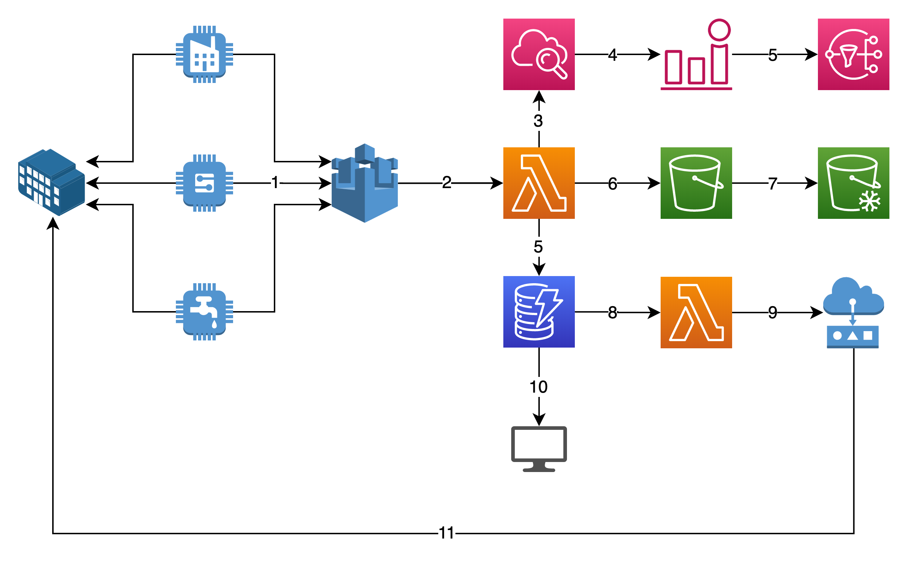

## Serverless-iot-stack <!-- omit in toc -->

A AWS serverless IoT stack deployed using Serverless Application Model (SAM).

This architecture was presented at the [AWS Summit 2022](https://aws.amazon.com/it/events/summits/milano/agenda/) in Milan (July 22) at the AWSome Stories Theater. A PDF version of the slide are available at [madeddu.xyz/aws_summit_2022.pdf](https://madeddu.xyz/aws_summit_2022.pdf)

## Contents
- [Contents](#contents)
  - [Big Picture](#big-picture)
  - [Requirements](#requirements)
  - [Build and deploy](#build-and-deploy)
    - [A little step before](#a-little-step-before)
  - [Start the monitoring simulation](#start-the-monitoring-simulation)

### Big Picture



The architecture presented show a simple IoT flow in a monitoring/remediation context: a simulator of a generic environment (played by the `monitoring` cli in the `src/monitoring` folder) simulates a sensor inside a building (1). This component send messages over MQTT to [AWS IoT Core](https://aws.amazon.com/iot-core/?nc1=h_ls) service (2) in an AWS account. An [AWS Lambda](https://aws.amazon.com/lambda/?nc1=h_ls) function written in Golang (code at `src/worker`) concurrently (3,6,5) provides input to the three pipeline shown:

- The first one consists in pushing some [AWS CloudWatch](https://aws.amazon.com/cloudwatch/?nc1=h_ls) custom metrics (3) that are visible over a Dashboard (available in JSON format inside the [AWS SAM](https://aws.amazon.com/cloudwatch/?nc1=h_ls) template at `src/template.yml`), that also contains some AWS CloudWatch alarms. Whenever the alarms change state, an [AWS SNS](https://aws.amazon.com/sns/?whats-new-cards.sort-by=item.additionalFields.postDateTime&whats-new-cards.sort-order=desc) notification is sent to specific subscriber - coded in the 

- The second consists in pushing the messages received in JSON format as object on S3 [AWS S3](https://aws.amazon.com/s3/?nc1=h_ls) (6) that are automatically rotated with ad-hoc lifecycle policy for historization purpose.

- The third and last "pipeline" is triggered by a [Dynamo Stream](https://docs.aws.amazon.com/amazondynamodb/latest/developerguide/Streams.html). In particular, messages are also pushed into an [AWS DynamoDB](https://aws.amazon.com/dynamodb/?nc1=h_ls) (5); the DynamoDB Stream trigger a remediation AWS Lambda function (stored in `src/remediation`) that act over the change (just drafted) and send a remediation message (9) to AWS IoT Core.

The `monitoring` cli listen also for specific remediation message coming from the cloud (11), interprets them and act accordingly by simulating a drift in the generated monitoring messages.

The overall goal of this infrastructure is to better visualize and demonstrate how you can build a monitoring/analysis/remediation pipeline using just a few Lambda and other almost costless AWS Services.

### Requirements

The only requirements you need is
- [Docker](https://www.docker.com/products/docker-desktop/)
- [AWS SAM](https://docs.aws.amazon.com/serverless-application-model/latest/developerguide/serverless-sam-cli-install.html) Cli.
- An AWS Account configured for your CLI
- A bucket for your sam deployment

### Build and deploy

To build and deploy the stack into your account, just run:

```sam build```

and then

```sam deploy```

Follow the instruction on requested information. A `samconfig.toml` can be saved for subsquent run without prompt.

After a while, the whole stack should be deployed. If this is not true, have a look at SAM output or let me know by opening an issue.

#### A little step before

Before starting the application that simulate monitoring part, you can go to your [AWS IoT Core](https://eu-west-1.console.aws.amazon.com/iot/home?region=eu-west-1#/connectdevice/) console and add a device - **this will guide you in the generation of a unique key/pair certicate with an associated IoT Core policy for restricting actions on MQTT broker**. These file are requested by the monitoring CLI: I could even use the IAM credentials stored in my profile and use the SDK of AWS to publis/subscribe to IoT, but I wanted to keep the behaviour as much as possible *similar* to a real scenario in which a device contains this key pair (maybe produced during the same creation of the sensors).

### Start the monitoring simulation

You can store the certs generated at the step below in a folder called `certs` or actually everywhere you want. A section in the init part of the golang let you customize the position of these certs:

```
...
	ROOT_CA_PATH            = "./certs/AmazonRootCA1.pem"
	DEVICE_CA_PATH          = "./certs/monitoring-device.cert.pem"
	DEVICE_PRIVATE_KEY_PATH = "./certs/monitoring-device.private.key"
...
```

To effectively test the infrastructure, you need to start your monitoring/actuator simulator. To this, just go to the `src/monitoring` folder and run:

```go run main.go --help```

This will output you all the parameters you can specify for the simulation. For instance, you can run:

```go run main.go --device-id 930129302 --velocity 1.2 --update-frequency 2.5 --remediation-factor 0.2 --log-level DEBUG```

to simulate a monitoring coming from the device `930129302` (also specified as parameter inside the `src/template.yml` file for the dashboard and cloudwatch metrics), the update velocity (a sin(x) multiplier factor to stretch the simulated periodic monitoring function), an update frequency in seconds to increment the number of message sent (have a look also at provisioning capacity passed as parameters to the respective dynamo table in `src/template.yml`), a remediation factor to simulate a new stretch of the generation function - thus actually changing the fake-registered data, and log-level of course. You can specify parameters or environment variables: for instance, in the example above the `-iot-endpoint` parameter is not specified since it was exported as environment variable in my shell.

